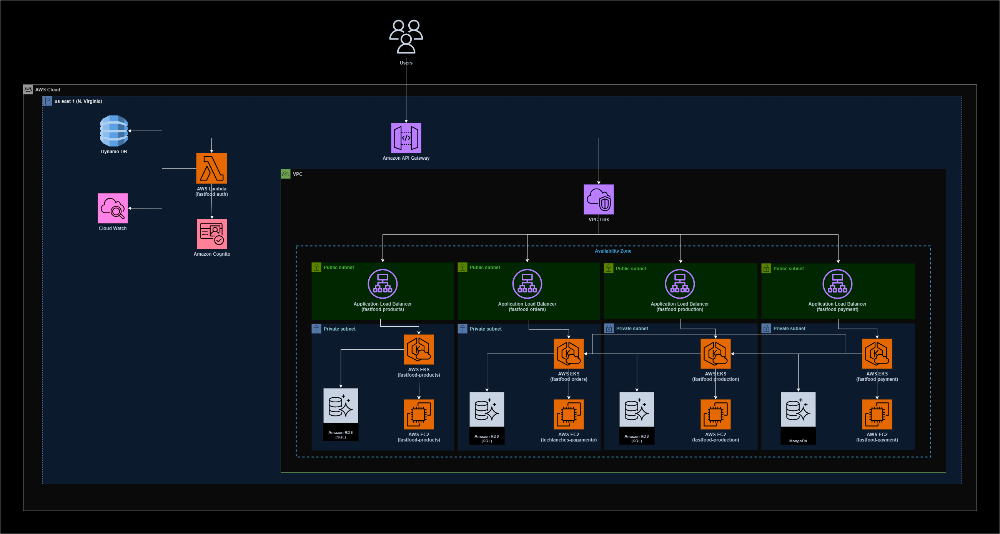
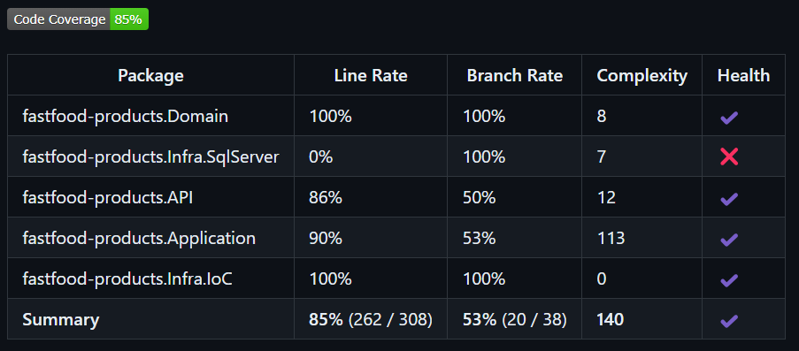

# fastfood-products

O repositorio fastfood-products tem por objetivo disponibilizar os CRUDs para gerenciamento dos produtos do fastfood, utilizando o SQLServer para persistência dos dados.

## Github Actions
### Necessário
* Configurar no GitHub as *Secrets and variables*, entrando em *Actions* e adicionando na parte *Repository secrets* a seguinte:
  * AWS_ACCESS_KEY_ID 
  * AWS_SECRET_ACCESS_KEY
* Rodar a primeira run no [Repositório Terraform](https://github.com/pos-4soat/fastfood-infra), para criação do ECR e RDS do SQL

Esse projeto tem um workflow de subir a imagem do projeto ao ECR ao realizar o merge para a branch main.

Fluxo:
* RUN 1 do terraform
* Workflow para realizar o deploy da imagem no ECR

## Execução do projeto
Para executar o projeto é fácil, basta apenas definir os valores paras as variáveis de ambiente dele, que se encontram no launchsettings.json da API.
Após isso, basta executar o projeto da forma que preferir, nós utilizamos o Docker para isso.

### Variáveis de ambiente
Todas as variáveis de ambiente do projeto visam fazer integração com algum serviço da AWS. Explicaremos a finalidade de cada uma:

- SqlServerConnection: Conexão com banco de dados SQL. Recurso gerado no RUN 1 do terraform, através do RDS;

## Arquitetura do projeto
A seguinte arquitetura foi utilizada para o projeto:



Como decidimos utilizar a AWS como plataforma nuvem, utilizamos o ECR para armazenar e gerenciar a imagem do contêiner da aplicação, EKS para implantar e gerenciar a aplicação em um cluster Kubernetes, HPA para escalar horizontalmente a aplicação . 
Para gerenciar melhor os dados do produto correlacionados com o pedido, optamos por utilizar o SQL Server. Por ser um banco de dados relacional, pensamos em utilizá-lo para armazenar os dados dos produtos criando relacionamentos com pedidos e produção. Nessa solução, apenas a tabela Produtos foi utilizada.

## Endpoints

Esse projeto possui 4 endpoints:

DELETE /product/{productId} -> Responsável por remover um produto da base de dados.

GET /product/{productId} -> Responsável por retornar todos os produtos.

GET /product/category/{categoryId} -> Responsável por retornar todos os produtos com base na categoria especificada.

POST /product -> Responsável por criar um produto com o seguinte json:
```
{
    "description": "Hamburguer de calabresa artesanal",
    "name": "X-Calabresa",
    "price": 18.50,
    "productImageUrl": "imgSrc",
    "type": 1
}
```

PUT /product -> Responsável por alterar um produto com o seguinte json:
```
{
    "description": "Hamburguer de calabresa artesanal",
    "name": "X-Calabresa",
    "price": 18.50,
    "productImageUrl": "imgSrc",
    "type": 1,
    "id": 1
}
```

## Cobertura de código
Fluxo de cobertura de código está presente no workflow, utilizando coverlet para gerar relatório:

